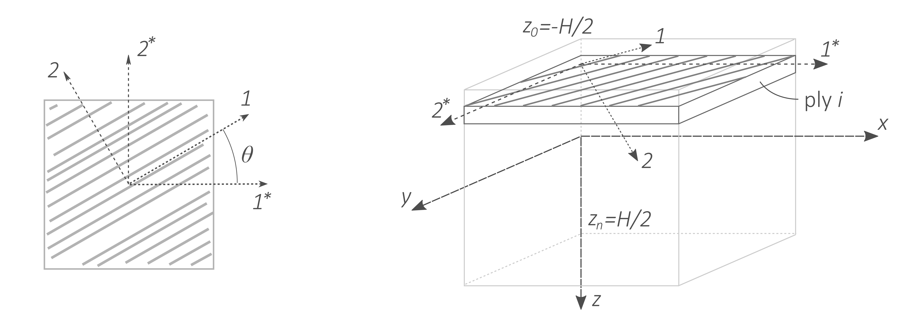

# m.CLT - Classical Lamination Theory in Matlab

[](https://opensource.org/licenses/MIT)

A collection of Matlab functions for the Classical Lamination Theory
(CLT). The functions are part of a Master course on Composites at the
University of Twente.

For background information on the CLT, the reader is kindly invited to
join the course :smirk:. If that is not an option, the following
sources are highly recommended:
* [MIT](https://ocw.mit.edu/courses/materials-science-and-engineering/3-11-mechanics-of-materials-fall-1999/modules/MIT3_11F99_laminates.pdf)
shared a short summary of the Classical Lamination Theory.
* [TU
  Delft](https://ocw.tudelft.nl/course-lectures/classical-laminate-theory-clt/)
  provides an open course on the topic.
* [efunda](https://www.efunda.com/formulae/solid_mechanics/composites/comp_laminate.cfm) has an online calculator with a bit of background information.

## Usage

You can clone the repository to your folder of choice using
[git](https://git-scm.com/downloads):

```
git clone https://github.com/wjbg/m.CLT.git
```

Alternatively, you can also download this repository as zip file by
clicking the green button at the top of this page. All functions are
reasonably well-documented - if I may say so - and the annotated
example below should be sufficient to get you started.

## Example

Consider a 24-ply quasi-isotropic laminate. The ply properties and ply
thickness are listed below. In the following, I will illustrate how to
use the functions to determine:

- The engineering constants of the laminate
- The deformation of the laminate and stress distribution due to an
  applied load
- The deformation of a laminate and the stress distribution because of
  a temperature change

### A few words on the coordinate systems

Before moving on, we should first take a look at the different
coordinate systems, as shown in Figure 1, and the way these are
indicated in the example. We can identify three coordinate systems:

- The _material_ coordinate system is indicated with `1` and `2`. Its
  axes are aligned with the principal directions of the ply. In the
  case of a ply with a unidirectional fiber reinforcement, the fiber
  orientation coincides with the `1` axis, while the `2` axis lies in
  the plane perpendicular to `1`.
- The _ply_ coordinate system is indicated with `1*` and `2*` and is
  rotated at an angle with respect the material coordinate system.
- The `x`, `y` and `z` axes correspond to the _laminate_ coordinate system.

<p align="center">
	
	<br>
	<em>Figure 1.</em> Material and ply coordinate systems (left) and laminate coordinate system (right).
</p>

### Ply properties and lay-up

The stiffness matrix in the material coordinate system is determined
using the function `stiffness_matrix`, which requires the Young's
moduli in the two principal directions, the shear modulus, and the
Poisson's ratio. In addition, we will need a vector with the
coefficients of thermal expansion.

```matlab
%% Material properties
E1 = 120E9;
E2 = 10E9;
v12 = 0.28;
G12 = 5E9;
alpha = [0.2E-6; 30E-6; 0];             % CTE's in material CS
                                        % [alpha_1, alpha_2, alpha_12]

C = stiffness_matrix(E1, E2, v12, G12); % stiffness matrix in material CS
```

### Stiffness matrix in ply coordinate system

The stiffness matrix in ply coordinate system is calculated using
`rotate_C`, which takes as input the stiffness matrix in material
coordinate system and a rotation angle in radians. In addition, also
an array of rotation angles can be used to obtain the stiffness matrix
in ply coordinate system for each ply in the layup. In this case, the
stiffness matrices are stored in the cell array `C_r`. Here, the
subscript `r` (from rotated) refers to the ply coordinate system, as
opposed to the material coordinate system when there is no subscript.

```matlab
%% Layup information
t = 0.15E-3;                % ply thickness
n = 24;                     % number of plies
layup_deg = QI_layup(n);    % lay-up orientation of each ply
layup = layup_deg*(pi/180);
z = ply_edges(t, n);        % z-coordinate of laminate edge and interfaces

C_r = rotate_C(C, layup);   % Cell array with the stiffness matrix
                            % of each ply in ply CS
```

The function `ply_edges` provides the location (in thickness
direction) of each ply interface and the outer surfaces with respect
to the mid-plane.

### ABD and abd matrix

The ABD matrix of the laminate is determined using the function
`ABD_matrix`, which takes as an input a cell array with stiffness
matrices in ply CS and the location of the ply interfaces. The abd
matrix is simply the inverse of the ABD matrix.

```matlab
%% ABD and abd matrix
ABD = ABD_matrix(C_r, z);
abd = inv(ABD);
```

### Engineering constants

The engineering constants can be calculated based from the abd matrix.


```matlab
%% Laminate engineering constants
% The engineering constants of the laminate can be determined from the
% abd-matrix as:
%
% $$E_x = \frac{1}{a_{11}H},\quad
%   E_y = \frac{1}{a_{22}H},\quad
%   G = \frac{1}{a_{22}H},$$
%
% with $H$ the laminate thickness.
E_x = 1/(abd(1,1)*n*t);
E_y = 1/(abd(2,2)*n*t);
G = 1/(abd(3,3)*n*t);
```

### Deformation and stresses due to an applied load

The deformation of the laminate due to an applied load can be
calculated by multiplying the abd matrix with the load vector:

- The load vector has six components. The first three represent the
  normal forces per unit width in x- and y-direction, and the shear
  force per unit width. The last three components concern the bending
  moments in x- and y-direction and the twisting moment per unit
  width.
- The deformation vector also has six components: the normal strains
  in x- and y-direction, the shear strain, the bending curvature in x-
  and y-direction, and twisting curvatures.

The stresses in the ply coordinate system are calculated using the
function `ply_stress`, and stored in a matrix `stress_r`. This matrix
has a size of size `3 x 2n`, with `n` the number of plies. Similar as
earlier, the subscript `r` refers to the ply coordinate system. The
elements in the first, second and third row correspond to the normal
stress in `1*`, `2*` direction, and the shear stress, respectively.
The columns correspond to the location, with column `2i-1` and `2i`
corresponding to the top and bottom of the i-th ply, respectively. The
stresses can then be rotated back to the material coordinate system
`rotate_stress_to_matCS`.

```matlab
%% Deformation and stresses due to an applied load
% Let us apply a tensile load in x-direction.
N = [1E5; 0; 0;  % Nx, Ny, Nxy (in N/m)
       0; 0; 0]; % Mx, My, Mxy (in Nm/m)

def = abd*N;     % Deformation vector with: [strain_x; strain_y; strain_xy;
                 %                            kappa_x;  kappa_y;  kappa_xy]

[stress_r, z_int] = ply_stress(def, C_r, z);      % ply CS
stress = rotate_stress_to_matCS(stress_r, layup); % material CS

% plot_stress(stress_r, z_int, 1);                  % stress in 1* direction
% plot_stress(stress_r, z_int, 2);                  % stress in 2* direction
% plot_stress(stress_r, z_int, 3);                  % shear stress in ply CS
```

### Deformation and stresses due to cooling down

In a similar fashion we can determine the deformation and stresses due
to thermal loading. For this purpose, we first determine the
coefficients of thermal expansion for each ply in the ply coordinate
system using `rotate_alpha`. Subsequently, `thermal_force` can be used
to determine the fictive thermal force vector.

```matlab
%% Deformation and stresses due to cooling
% Consider the laminate is cooled down from a processing temperature of
% 220C to room temperature.
deltaT = -200;
alpha_r = rotate_alpha(alpha, layup);         % CTEs for all plies in ply CS
Nth = thermal_force(C_r, alpha_r, z, deltaT);
def = abd*Nth;

[stress_r, z_int] = ply_stress(def, C_r, z, alpha_r, deltaT); % ply CS
stress = rotate_stress_to_matCS(stress_r, layup);             % material CS

% plot_stress(stress, z_int, 1);                  % stress in 1 direction
% plot_stress(stress, z_int, 2);                  % stress in 2 direction
% plot_stress(stress, z_int, 3);                  % shear stress in mat CS
```

## License

Free as defined in the [MIT](https://choosealicense.com/licenses/mit/)
license.
